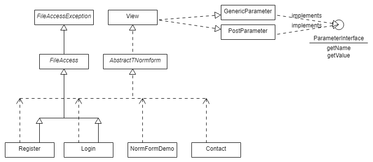

# PHPintro 2018.0

*PHPintro* stellt das Grundgerüst für einführende Übungen im Bereich Webprogrammierung zur Verfügung.

Templates und CSS werden in weiten Teilen zur Verfügung gestellt. 

Besuchen sie uns unter https://www.fh-ooe.at/en/hagenberg-campus/studiengaenge/bachelor/media-technology-and-design/

Verwendete Technologien und Vorraussetzungen

Für das Übungsscenario wurde mit [Vagrant](https://www.vagrantup.com/) und [Virtualbox](https://www.virtualbox.org/) 
entwickelt. 
Ein passendes [Vagrantfile](https://github.com/Digital-Media/hgb-phpdev-base) findet sich ebenfalls auf GitHub. 
*PHPintro* lässt sich aber auch unter anderen Entwicklungsumgebungen installieren.

PHP 7.1 ist die Mindestvoraussetzung, damit die Implentierung lauffähig ist.

* [HTML5](https://www.w3.org/TR/html5/)
* [CSS3](https://www.w3.org/Style/CSS/specs)
* [PHP 7.0](http://php.net/manual/en/migration70.new-features.php)
* [PHP 7.1](http://php.net/manual/en/migration71.new-features.php)
* [TNormform](https://github.com/Digital-Media/normform)
* [Smarty Templates](http://www.smarty.net/)
* [CSS3 Flexbox](https://www.w3.org/TR/css-flexbox-1/)
* [PHP-FIG Namenskonventionen](http://www.php-fig.org/bylaws/psr-naming-conventions/)

Die Übungen, die umzusetzen sind, liegen in src/exercises. 
Lösungen werden mit require_once aus einem privaten Repository eingebunden.
Diese Abschnitte sind durch eine eigene Lösung zu ersetzen.

Zum Beispiel:  
    ``/*--``
    ``require_once '<path-to-solution>/index/construct.inc.php';``
    ``//*/``

Durch Ein- und Auskommentieren der Lösung kann sowohl die Funktionalität der Vorlage als auch der Lösung einfach
demonstriert werden.
Das Umschalten erfolgt über Linux Shell-Scripten, die im Lösungsrepository liegen und dazu GNU sed nutzen.

## Structure of this Repository

Folder | Description
--- | ---
``data`` | Directory to hold the json files, to store user credentials or testdata with class FileAccess 
``examples`` | Examples for developing with PHP 7.x. 
``htdocs`` |Frontend stuff. Files called by Webserver, that create the objects with the real implementation, templates and css
``htdocs/css`` | A set of predefined styles to be used with [AbstractNormForm](https://github.com/Digital-Media/normform). Include ``main.css`` to use it.
``htdocs/templates`` | HTML templates for the Smarty template engine used in ``/src/*.php``.
``htdocs/templates_c`` | Output folder for Smarty's compiled templates.
``src`` | Classes implemented for *PHPintro*. Including a demo for [NormFormDemo](https://github.com/Digital-Media/normform) and FAdemo for FileAccess. The Trait Utilities provides static helper method to be used in any context.
``src/exercises`` | Classes to be implemented for *PHPintro* exercises.
``vendor`` | Third party libraries installed with composer: [TNormform](https://github.com/Digital-Media/normform), [Smarty Templates](http://www.smarty.net/), Javascript Libraries ...

Ein grobes Klassendiagramm für PHPintro (erstellt mit http://www.umlet.com/umletino/

